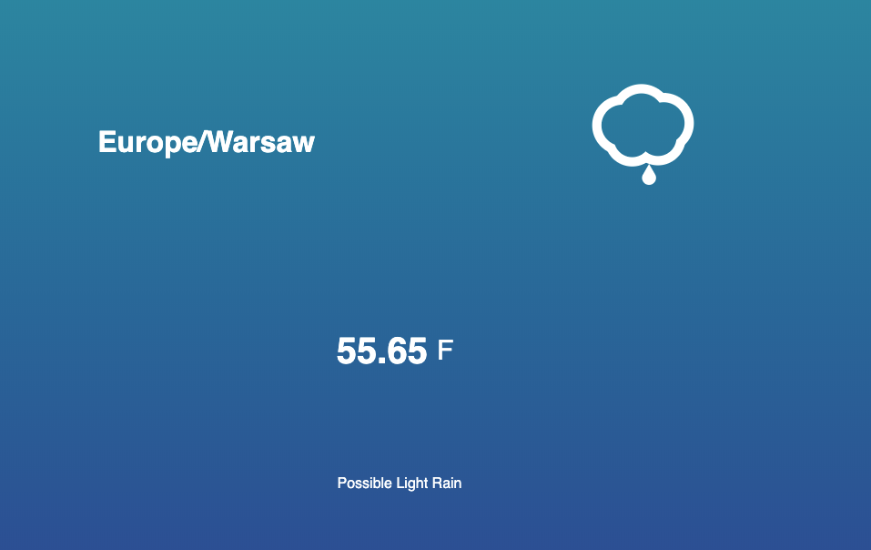
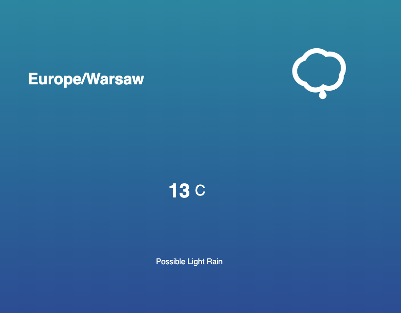

# Wearher.App

## Table of contents
* [General info](#general-info)
* [Technologies](#technologies)
* [Demo link](#demo-link)

## General info
This is a simple weather JavaScript application created in small among of time. The application displays weather conditions based on your location. To change from Fahrenheit/Celsius simply click by mouse on temperature degrees. Below the demo link.

    

    

## Technology
* JavaScritp
* HTML5 
* CSS3 
* Skyicons

## Demo 
[Demo link](https://coffeina.github.io/Wearher.App/)
